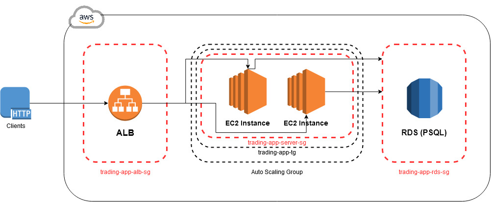
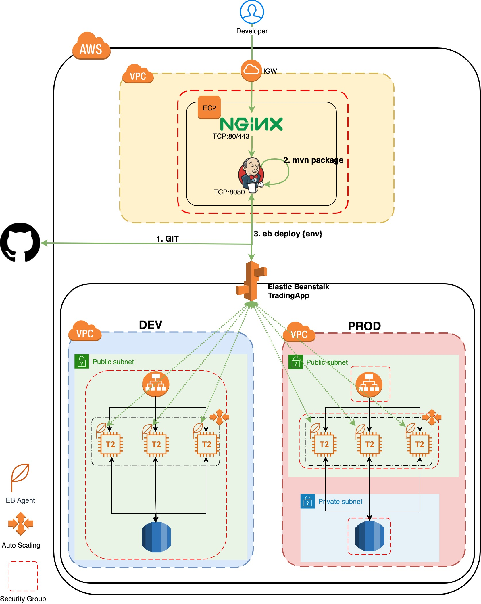

# Cloud & DevOps Project

-	[Introduction](#introduction)
-	[Cloud Application Architecture](#cloud-application-architecture)
-	[Deployment Environments](#deployment-environments)
-	[Jenkins Server & CI/CD pipeline](#jenkins-server-and-pipeline)
-	[Improvements](#improvements)

## Introduction

The purpose of this project was to deploy the Springboot trading-app microservice on the Amazon Web Services (AWS) cloud. Since the app's usage may vary during the day, it should be scalable, elastic, and high available which is achievable if deployed on AWS. The cloud services that I used are AWS's Elastic Cloud Compute (EC2), Amazon Relational Database Service (RDS), and AWS's Elastic Beanstalk (EB). I will go into further detail about each of these services below. Furthermore, I also created a Continuous Integration (CI)/Continuous Delivery (CD) pipeline using Jenkins to automate and fasten the deployment life cycle.

## Cloud Application Architecture

Below is our cloud application architecture diagram:

-	***EC2***: EC2 or Elastic Compute Cloud is essentially a computer/server in the cloud hosted by AWS, it is a scalable and elastic computing resource that allows us to develop and deploy applications without hardware constraints.

-	***RDS***: Amazon Relational Database Service is a distributed relational database service by AWS. It is a web service running in the cloud designed to simplify the setup, operation, and scaling of a relational database for use in applications.

-	***Security Groups***: Security groups are used to control the inbound and outbound traffic for our instances.

-	***ALB***: An Application Load Balancer (ALB) is a software based load balancer which can be set up and configured in front of a collection of EC2 instances and automatically distributes incoming traffic across multiple targets that are available to receive requests.

-	***Target Groups***: A target group tells a load balancer where to direct traffic to and can be EC2 instances, fixed IP addresses, etc. When creating a load balancer, you create one or more listeners and configure listener rules to direct the traffic to one target group.

-	***Auto Scaling***: AWS Auto Scaling monitors applications and automatically adjusts capacity to maintain steady, predictable performance at the lowest possible cost.

## Deployment Environments

Below is a diagram of our Deployment Environment:

-   The DEV environment consists of EC2 and RDS instances I created that run our application and the database. It's common that developers share the same DEV env and deploy GIT `feature` and `development` branches. This environment is not available to external teams or clients.
-   The PROD environment will be consumed by clients. The master branch will be deployed. 

I used Elastic Beanstalk to create both of these environments. AWS Elastic Beanstalk is a service offered by Amazon Web Services for deploying applications which orchestrates various AWS services, including EC2, S3, autoscaling, and Elastic Load Balancers.

An Elastic Beanstalk application is a logical collection of Elastic Beanstalk components, including environments, versions, and environment configurations. In Elastic Beanstalk an application is similar to a folder in concept. An environment is a collection of AWS resources running an application version. 

Each environment runs only one application version at a time, however, you can run the same application version or different application versions in many environments simultaneously. When you create an environment, Elastic Beanstalk provisions the resources needed to run the application version you specified.

### Jenkins Server and Pipeline

Jenkins is a free and open source automation server and helps to automate the non-human part of the software development process, with continuous integration and facilitating technical aspects of continuous delivery. It is a server-based system that runs in servlet containers such as Apache Tomcat.

Jenkins' pipelines are able to executes deployment commands automatically on a Jenkins Server (I used a Ubuntu EC2 instance). The pipeline steps are defined in a Jenkinsfile which is stored at this location: `cloud_devops/springboot/Jenkinsfile`.

As shown in the diagram above, the pipeline will execute the following steps:

1.  First download the source code after specifying the GIT repo
2.  `mvn clean package` trading-app source code which generates a zip file for EB deployment
3.  Deploy the zip file into the corresponding EB environment (e.g. develop branch will be deployed into DEV env) using `eb` command

## Improvements

1. Try experimenting with multiple client requests to increase work load and see how that affects our instances (test the elasticity and scalability).
2. Test out the DEV and PROD environments by having another developer push changes and make sure the pipeline still runs smoothly.
3. Incorporate Amazons S3 service and store data there and have our application access that data, just to get more familiar with that AWS service.
