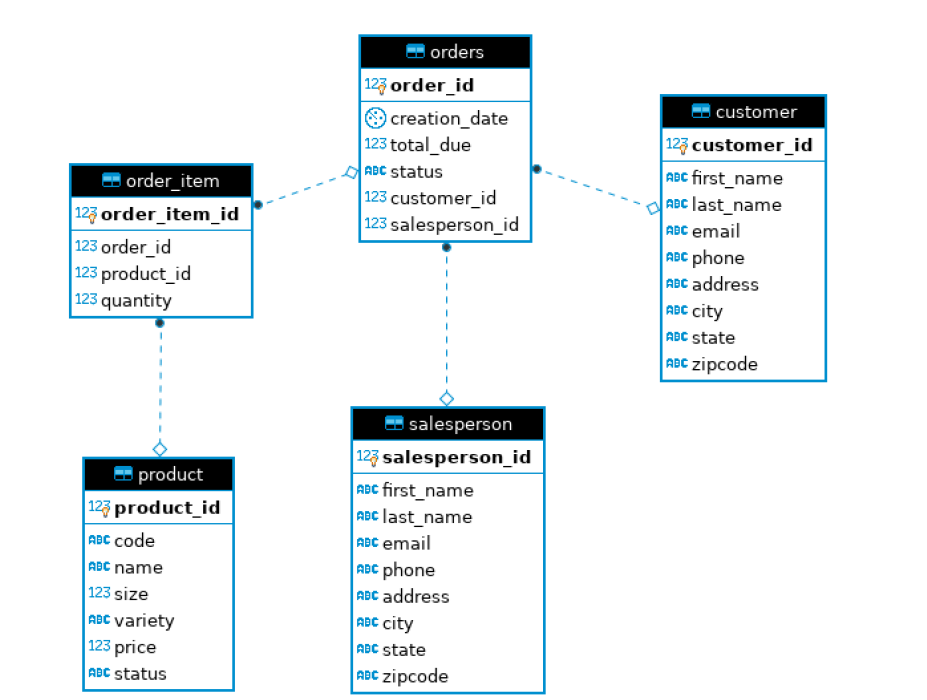

# JDBC Application

## Introduction

This application utilizes JDBC in order to connect to a PSQL database and manipulate our data as required. In my implementation, I create, read, update, and delete (CRUD) data from the database with the Data Access Object design pattern. A user can easily connect to the database through our Java application and make all these changes by simply changing the SQL commands as required and running the application. 

## ER Diagram

Below is the ER (Entity-Relationship) diagram that shows the relationship of our tables.



## Usage

For setting up our database, run the following commands from the `sql_scripts` folder:

``` Bash
docker pull postgres

mkdir -p ~/srv/postgres

sudo docker run --rm --name lil-postgres -e POSTGRES_PASSWORD=password -d -v $HOME/srv/postgres:/var/lib/postgresql/data -p 5432:5432 postgres

psql -h localhost -U postgres -f database.sql
psql -h localhost -U postgres -d hplussport -f customer.sql
psql -h localhost -U postgres -d hplussport -f product.sql
psql -h localhost -U postgres -d hplussport -f salesperson.sql
psql -h localhost -U postgres -d hplussport -f orders.sql
```
Note the password in the above commands is set to "password" but you can change this. 

Then to run our application, simply open `JDBCExecutor.java` in intelliJ, after importing the project and run it (or make changes to customers/orders as required first)

## Design Patterns

The two design patterns that I used in this application are the DAO (Data Access Object) design pattern and also the Repository design pattern. 

Both design patters are used to separate the data persistence logic in a separate layer. This way, the service remains completely in the dark about how the low-level operations to access the database is done. 
Or in other words, they hide the details of data access logic from the business logic. They allows business logic to access the data object without having knowledge of underlying data access architecture.

The difference between the two is that DAO is an abstraction of data persistence and Repository is an abstraction of a collection of objects. Repository could be implemented with DAO's but not the other way around. In DAO design pattern, DAO classes can access multiple databases but in Repository design pattern, each DAO class can only access one table.

In our implementation, `OrderDAO` is an example of the DAO design pattern (since it accesses all 5 tables) and the `CustomerDAO` is an example of the Repository design pattern (since it accesses only the Customer table).
