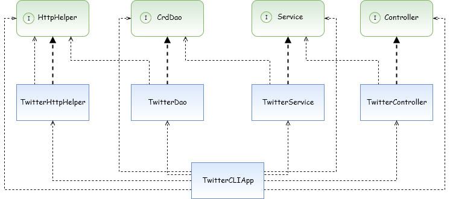

# TwitterCLI Application

## Introduction

This application allows users to post, find, and delete tweets for their Twitter account right from our Application instead of doing it directly from Twitter. It does this by utilizing the Twitter REST API and sending GET and POST HTTP requests. Tweet objects are defined in our Model as we are using MVC (Model, View, Controller) and DAO design patterns. The class dependency relationships are shown in the Design section in a UML diagram and are managed with the Spring framework. The app was build and managed with Maven.

## Design

Below is the UML  diagram that shows our class dependency relationships.



### Components

-	***DAO***: `TwitterHttpHelper` creates a connection between the application and the Twitter API in order to post, show, or delete a tweet. Authentication is done with OAuth 1.0 protocol to make sure you have authority to post/delete/get tweets from an account. `TwitterDao` calls `HttpHelper` after constructing a URI which is required in order to post, delete, or get Tweets.
-	***Service***: The service layer handles business logic and in our case, the `TwitterService` class verifies that the Tweet length is within limit and the Coordinates as well as the ID are valid. Then it calls `CrdDao` once the checks are completed and passed.
-	***Controller***: The controller layer consists of the `TwitterController` class and it validates the input given from the user, and then invokes the appropriate method by calling `Service`.
-	***Application***: The application layer gathers user input from the command line and invokes methods by calling `Controller` after making sure that the input is not empty. `TwitterCLIApp` is where all components (lower layers) are declared and instantiated. 

## Quick Start

1.	First we need to setup our environment variables which consist of Keys and Tokens acquired from a Twitter Developer Account. In order to do this use the following commands:
``` Bash
export consumerKey="Insert your Consumer Key here"
export consumerSecret="Insert your Consumer Secret here"
export accessToken="Insert your Access Token here"
export tokenSecret="Insert your Token Secret here"
```
2.	For this step you need to already have Maven installed. Go to the root twitter folder and run this command: 
``` Bash
mvn package
```
3.	Now we can run commands to actually get, post, or delete Tweets. We can do so with the following type of command:
``` Bash
java -jar target/twitter-1.0-SNAPSHOT.jar post|show|delete [additional arguments]
```

Below are the formats required for post, show, and delete options:

For posting a Tweet:
``` Bash
java -jar target/twitter-1.0-SNAPSHOT.jar post "tweet_text" "Longitude:Latitude"
```

For showing a Tweet:
``` Bash
java -jar target/twitter-1.0-SNAPSHOT.jar show "tweet_id"
```

For deleting a Tweet:
``` Bash
java -jar target/twitter-1.0-SNAPSHOT.jar delete "tweet_id1,tweet_id2,..."
```
## Model

Our Tweet model is a simplified version of the full Tweet Model on Twitter's API. We define our Tweet Model in the `Tweet.java` POJO in our Model folder. We also have `Entities.java`, `Hashtag.java` , `UserMention.java`, and `Coordinates.java` to help implement those JSON properties. Here is a sample JSON output of our Tweet Model:

``` JSON
{
	"created_at":"Thu Nov 28 20:11:33 +0000 2019",
	"id":1200145224103841792,
	"id_str":"1200145224103841792",
	"text":"test post",
	"entities":{
		"hashtags":[ ],      
		"user_mentions":[ ]  
	},
	"coordinates":-1:1,    
	"retweet_count":0,
	"favorite_count":0,
	"favorited":false,
	"retweeted":false
}
```

## Improvements

1. Allow for an option to have a scheduled post or delete. This could be extremely useful for some users as they can just setup a post beforehand and let it happen on its own later.
2. Make the usage of the app simpler. Can do this by having a shorter command to execute instead of this whole lengthy line: "java -cp target/twitter-1.0-SNAPSHOT.jar"
3. Right now when we show tweets, it returns the full Tweet Model JSON, so it shows every field. Adding an option to print out only certain fields could be useful.
