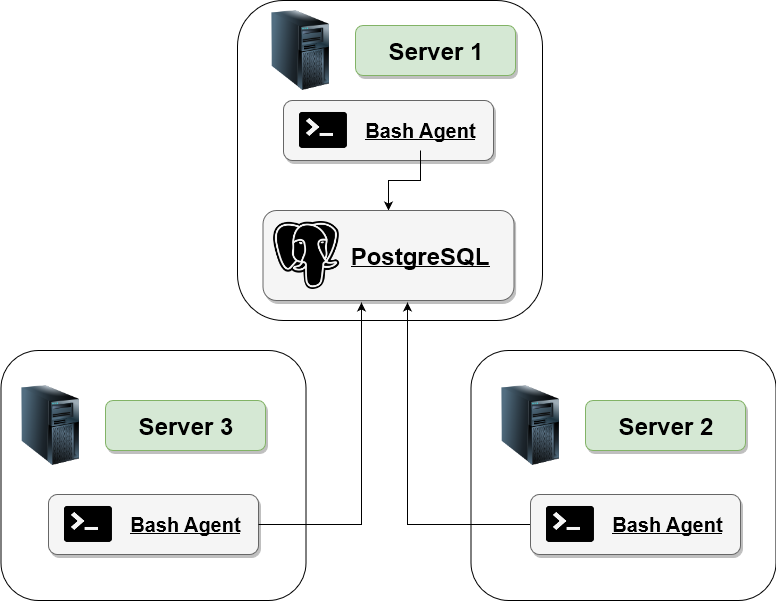

# Linux Cluster Monitoring Agent

## Introduction

This project consists of a Linux Server Cluster Monitoring Tool that requires the provided monitoring agent to be installed on each server in order to monitor the cluster resources.

The Linux Cluster Administration (LCA) team needs to record the hardware specifications of each server and monitor server resource usages (e.g. CPU/Memory) in real time. This tool's purpose is to assist the LCA team to adequately plan future resources (such as adding, removing, or improving servers) by giving them the required information stored in a database.

## Architecture and Design

Here is an architectural diagram that shows a high level overview of this Project:

<p align="center">
  
</p>
 

A psql instance that is stored on Server 1 is used to persist all the required data. 
The bash agent on each server gather and insert that data into the psql instance. 
Below is information on each file in the file directory (bash scripts and sql queries)

### Script Descriptions

- ``host_info.sh``
	- This script only runs once at installation and is used to collect the host hardware information and then inserts it into the psql database.
- ``host_usage.sh``
	- This script collects host usage info (such as the CPU and memory) and then inserts it the psql database. It is triggered by the "crontab" job and runs every minute.
- ``psql_docker.sh``
	- This script is used to start and stop the psql database with docker.

### SQL Query Descriptions

- ``ddl.sql``
	- This script automates the psql database initialization, it creates the `host_info` database and also tables, `host_info` and `host_usage`
- ``queries.sql``
	- This is a set of SQL queries that are used to answer user stories, this our case to provide answers to questions that the LCA team has in order to manage the cluster better and also plan for future resources.

## Usage

1. **First step is to start docker and our PostgreSQL Instance**
	So for this step we need to create a PSQL instance with docker and the psql_docker.sh file will help us with that.
	Go to the linux_sql folder and use the following command:
	```
	./scripts/psql_docker.sh start dbpassword
	```
	
2. **Next is to create the database and tables**
		The following command will create our required database and tables:
	```
	psql -h psql_host -U psql_user -f sql/ddl.sql
	```
	You can use 'localhost' as `psql_host` and 'postgres' as the `psql_user` as an example.
	
3. **Run the host_info script**
	We need to store hardware specs to the table so to run this script use:
	```
	./scripts/host_info.sh psql_host psql_port db_name psql_user psql_password
	```
	Once again, an example would be 'localhost' as `psql_host`, 5432 as `psql_port`, "host_agent" as `db_name`, 'postgres' as the `psql_user`, 'mypassword' as 	`psql_password`
	
4. **Finally we run host_usage script every minute with crontab**
	First use this command to run and edit crontab jobs:
	```
	crontab -e
	```
	Next copy this into the file to run our script every minute:
	```
	* * * * * bash [path]/host_usage.sh psql_host psql_port db_name psql_user psql_password > /tmp/host_usage.log
	```
	Here, [path] is the entire path that the host_usage.sh file is stored in, for example:
	/home/centos/dev/jrvs/bootcamp/linux_sql/host_agent/scripts/host_usage.sh

	Lastly, we can verify if our script is running with crontab use:
	```
	crontab -ls
	```
 
## Improvements

1.	One big improvement could be to have a just one script that can do all the steps above in one go. This will make the job much especially for someone who is newer to linux to run this Monitoring agent.

2.	Another improvement could be to have some sort of system to detect if memory or CPU usage is getting too high for one of the servers. This would definitely help the LCA team as it would be beneficial info for future planning.

3.	Lastly, I think having an automated report could also be beneficial, so we can send the LCA team a report every two weeks automatically for example.
