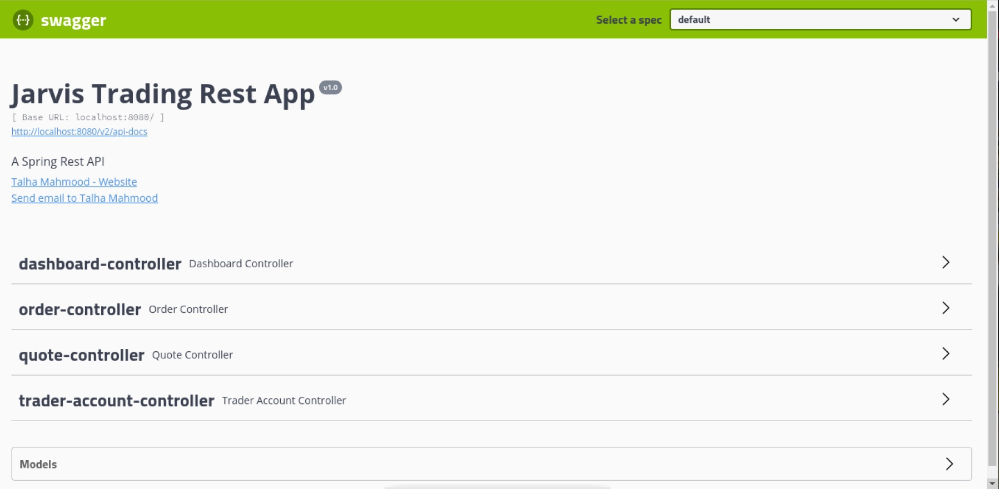
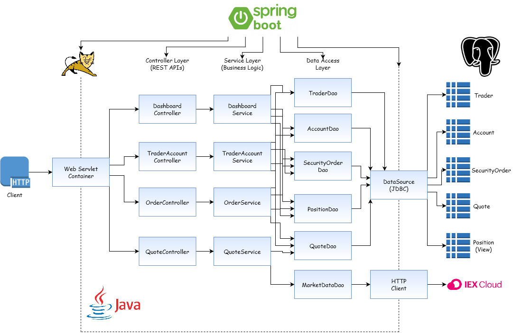
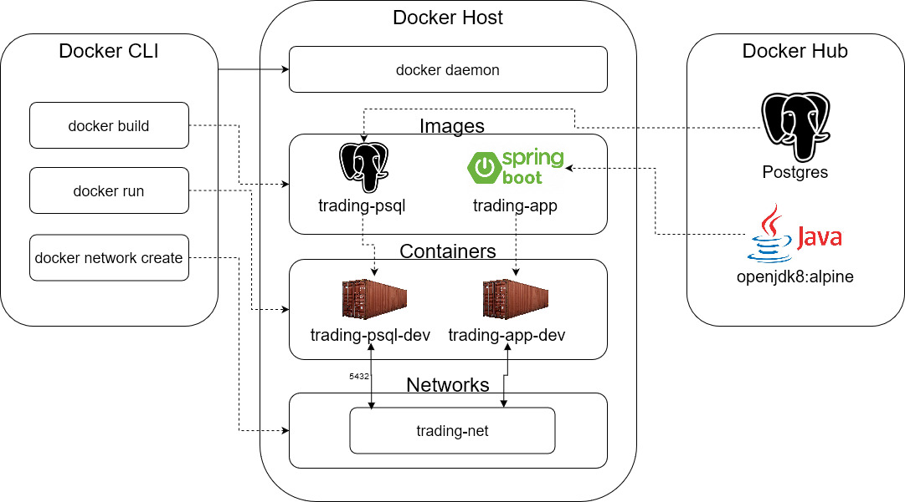

# Springboot Trading Application

-	[Introduction](#introduction)
-	[Quick Start](#quick-start)
-	[Architecture](#architecture)
-	[Rest API Usage](#rest-api-usage)
-	[Docker Deployment](#docker-deployment)
-	[Improvements](#improvements)

## Introduction

This application is an online stock trading simulation REST API and was built with the Springboot framework and utilizes MVC (Model, View Controller) and Microservice design architectures. It gets stock market data from IEX Cloud (IEXCloud.com) by making HTTP Calls against their API. It also stores Trader, Account, Quote, and Security Order data into a PSQL database as our application defines Models for each. The app was build with Maven and deployed using Docker containers. This API can be used by anyone, any type of developer or trader can use it using their web browser (with the Swagger UI) after starting the docker containers.

## Quick Start

Before we get started, you need to have Docker and Maven installed as well as get an API Token from IEX Cloud at IEXCloud.com. These steps are specifically for linux operating systems.

1.	First we need to setup our environment variables and the only one we need is the IEX Token (you can also hide your psql user and password and make variables for those if needed). In order to do this use the following command:
``` Bash
export IEX_PUB_TOKEN="Insert your API Token here"
```

2.	Now lets confirm if docker and maven are installed and check their versions (we need docker version 17.05 or higher): 
``` Bash
mvn -v
docker -v
```

3.	Make sure docker is up and running
``` Bash
sudo systemctl status docker || sudo systemctl start docker
```

4.	Now create a new docker network
``` Bash
sudo docker network create --driver bridge trading-net

#verify if it has been created with:
sudo docker network ls
```

5.	Now we create our database image
``` Bash
cd ./springboot/psql 
sudo docker build -t trading-psql . 

#verify it has been created with:
sudo docker image ls -f reference=trading-psql
```

6.	Create our application image
``` Bash
cd ./springboot/
sudo docker build -t trading-app .

#verify it has been created with:
sudo docker image ls -f reference=trading-app
```

7.	Start up a database container attached to the trading-net network
``` Bash
sudo docker run --name trading-psql-dev \ 
-e POSTGRES_PASSWORD=password \ 
-e POSTGRES_DB=jrvstrading \ 
-e POSTGRES_USER=postgres \ 
--network trading-net \ 
-d -p 5432:5432 trading-psql
```

8.	Start up a trading application container attached to the trading-net network
``` Bash
sudo docker run --name trading-app-dev \ 
-e "PSQL_URL=jdbc:postgresql://trading-psql-dev:5432/jrvstrading" \ 
-e "PSQL_USER=postgres" \ 
-e "PSQL_PASSWORD=password" \ 
-e "IEX_PUB_TOKEN=${IEX_PUB_TOKEN}" \ 
--network trading-net \ 
-p 5000:5000 -t trading-app
```

9. Verify if both containers are up and running
``` Bash
#you should see two docker containers running 
sudo docker container ls
``` 

10. The final step now is to consume the REST API with the application running, we can make HTTP calls using our Swagger UI or with another API tool (such as Postman or Insomnia REST Client, etc.). 

	To use our Swagger UI, simply go to: http://localhost:5000/swagger-ui.html

	
	
	For further instructions on how to consume the API from there, go to [Rest API Usage](#rest-api-usage)

## Architecture

Below is the component diagram for our application:



-	***Controller Layer***: The controller layer takes user input, handle HTTP requests and then makes calls to the service layer. User input is validated and we retrieve the required model data to return the appropriate responses.

-	***Service Layer***: The service layer handles business logic such as making sure that an order is not empty or making sure if the trader account already exits or if its empty. Then it makes a call to the DAO layer after the checks are passed.

-	***DAO Layer***: The DAO Layer is responsible for facilitating data exchange with our database and also with IEX Cloud. This is the layer we need in the application tier which consists of Controller, Service, and DAO layers.

-	***Springboot***: Springboot framework is what is used in this project and it consists of Spring, which helps us with dependency management of each of the layers mentioned above and a web servlet, in our case that is the embedded Tomcat to deploy our application. 

-	***PSQL and IEX***: As mentioned earlier, PSQL or PostgreSQL is the database we are using and where we are storing our application data. It's what the DAO layer accesses to exchange data, as well as data from IEX Cloud, which is just a REST API we are using in order to get stock market data. Both our PSQL database and IEX Cloud comprise our Database Tier. 

## Rest API Usage

-	***Swagger***: Swagger UI is an open source project to visually render documentation for an API defined with the Swagger Specification. We are using it help make it easy for users to consume our REST API. You can use alternative applications such as Postman to make HTTP calls on our REST API but Swagger what comes with this application for ease of use in the browser.

**Below are the REST API Endpoints for each controller that are found on the Swagger UI with their explanation.**

-	***Quote Controller***:  Quote Controller handles requests that want to get or change data in the `quote` table and also stock market data from IEX Cloud, in this case the data is cached to the `quote` table. These are the endpoints that the Quote controller handles:
	- `GET /quote/dailyList`: This endpoint shows all securities that are available for trading in this trading platform. Returns all quotes in our `quote` table.
	- `GET /quote/iex/ticker/{ticker}`: This shows a quote from iexQuote of the specified ticker. If invalid ticker then 400 response status returned.
	- `POST /quote/tickerId/{tickerId}`: Adds a new ticker to the dailyList, this ticker is now added to our `quote` table and should be updated when dailyList is called.
	- `PUT /quote/`: Update a given quote in the `quote` table by manually entering each parameter. For example: 
		- we can update ticker=AMZN 
		- bidPrice=9.0 
		- askPrice=10.0 
		- lasPrice=9.5
		-   askSize=bidSize=99
		The returned response should be code 200 and response body: 
			{ "ticker": "AMZN", "lastPrice": 9.5, "bidPrice": 9, "bidSize": 99, "askPrice": 10, "askSize": 99, "id": "amzn" }
	- `PUT /quote/iexMarketData`: Update the entire `quote` table using iex data. So all of our quotes currently in the table will have their values reset to whatever data iexQuote has. 
	
-	***Trader Controller***: Trader Controller handles requests that want to get or change data in the `trader` table and also the `account` table as traders must have a trading account associated. Traders can be created a few different ways and we can also adjust their account balances. These are the endpoints that the Trader controller handles:
	- `POST /trader/*`: This endpoint allows you to create a new trader and we have two options to do so. The first will allows you to create new trader using HTTP request body, and the other one allows you to use URL. We need to specify the firstName, lastName, dob, country, and email for both. id should not be specified as it will be auto generated and an account will also be created with that same id.
	- `PUT /trader/deposit/traderId/{traderId}/amount/{amount}`: This endpoint is for depositing into the trader account with the specified amount. Returns 400 error status code if deposit amount is negative.
	- `PUT /trader/withdraw/traderId/{traderId}/amount/{amount}`: This endpoint is for withdrawing from the trader account with specified amount. Returns 400 error status code if insufficient funds.
	- `DELETE /trader/traderId/{traderId}`: This endpoint allows us to delete a trader by specifying the traderId. In order to delete, you first need to close all positions and withdraw all funds.

-	***Order Controller***: Order Controller handles requests for buying and selling orders, which is an essential part of our application. It updates the `account` and `security_order` tables after executing the required operation. It only has one endpoint to post a market order:
	- `POST /order/marketOrder`: Executes a order with specified accountId, ticker, and size. Size is what determines if it is a buy or sell order. If size is positive, then it is a buy order or if its negative then it is a sell order.

-	***Dashboard Controller***: Dashboard Controller handles requests to view and return Trader info. These are the two endpoints that the Trader controller handles:
	- `GET /dashboard/portfolio/traderId/{traderId}`: This endpoint returns the Trader's trading portfolio by specifying the traderId. It returns a list of all the securities that the Trader has invested in.
	- `GET /dashboard/profile/traderId/{traderId}`: This endpoint shows the Trader's profile including the trader's account info.

## Docker Deployment

Below is a diagram of how the Docker Deployment works:



With the docker daemon, we build our two docker images (with `docker build`). 

The first image, `trading-psql` is built by pulling the `postgres` image from the Docker Hub and the `trading-app` image is built by pulling the `alpine` image from the Docker Hub. 

We have two Dockerfiles, one for the database and one for the application. We specify details about our database in our Dockerfile so that it uses our schema psql file to create our required tables on the database. And the Dockerfile for the application specifies how to build the app using Maven. 

Finally, when we create two containers (one for each of the created images) with `docker run` and they are attached to our created `trading-net` network (which was created with `docker network create`) so that they can communicate with each other.

## Improvements

1. Allow for an option to have a scheduled order so that a trader can make an order at a later time.
2. Make the Swagger UI webpage easier to use, more user friendly for some of the endpoints.
3. Keep a history of the trader account even after it is deleted, right now if a trader account is deleted, we will have no remaining record of it.
4. Possibly have an easier way to start our application for new users, make it a faster process to get it up and running.
5. Backup our PSQL database to another location just in case anything goes wrong. We should be able to periodically back it up to some server.
